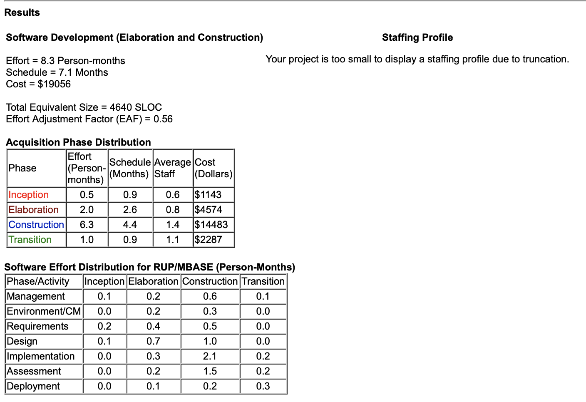

# Predlog projekta

|                             |                                                                |
| :-------------------------- | :------------------------------------------------------------- |
| **Naziv projekta**          | Musicer                          |
| **Člani projektne skupine** | Miha Godec, Vid Potočnik, Matic Conradi, Lucijan Semprimožnik, Luka Kolar |
| **Kraj in datum**           | Ljubljana, 9.3.2022                                  |

## Povzetek projekta

Glasba predstavlja pomemben del življenja vsakega posameznika. Prav tako pomemben del posameznikovega
življenja predstavljajo njegovi prijatelji oz. njegov partner. Bi bila izbira prijateljev oz. partnerja lažja,
če bi vedeli, da ta oseba posluša enako zvrst glasbe kot mi?  
V sklopu projekta bo razvita mobilna "dating" aplikacija, ki bo namenjena spoznavanju novih ljudi, s podobnim
okusom za glasbo. Seveda vsi poznamo dating aplikacije kot so Tinder, Bumble ipd., vendar te aplikacije povezujejo
ljudi primarno glede na njihove fotografije in preference glede spola in starosti. Naša ideja je, da ljudi povežemo,
glede njihovih najljubših izvajalcev, najljubših pesmi in zvrsti. Podatke o le teh bo lahko uporabnik izpolnil sam,
lahko pa bo tudi povezal našo aplikacijo s svojo najljubšo streaming platformo in tako samodejno prenesel podatke.
Uporabnik se bo tako prijavil v aplikacijo, jo povezal s svojo izbrano streaming platformo, nato pa mu bo naš algoritem,
na podlagi njegovega glasbenega profila, prikazal ostale uporabnike s podobnim profilom. Uporabnik se nato odloči, ali
se želi s tem uporabnikom povezati, in v primeru, da se oba uporabnika odločita za le to, se jima ponudi možnost pogovora. 

## 1. Projektna ideja

### 1.1 Ozadje

Nove generacije zelo rade posegajo po raznih aplikacijah za spoznavanje novih ljudi, saj zaradi previdnosti
ali pa socialne tesnobe, osebo najprej raje spoznajo "online", šele nato so pripravljeni osebo spoznati v živo.  
Na področju aplikacij za spoznavanje novih ljudi, obstaja že par aplikacij, vendar se naša ideja razlikuje v par
bistvenih funkcionalnostih, katere bomo predstavili v razdelku 1.2.  
Dobra aplikacija za spoznavanje novih ljudi, mora biti na pogled privlačna, uporabnik se mora počutiti varen, algoritem 
za prikazovanje drugih uporabnikov pa se mora čimbolj približati željam uporabnika.

### 1.2 Področje in motivacija

Motivacija za projekt je želja po aplikaciji, kjer bi lahko spoznal ljudi s podobnim okusom za glasbo. To bi
omogočilo uporabniku, da spozna nove prijatelje s katerimi bi lahko hodil na razne koncerte ipd. Tudi če uporabnik išče,
partnerja, smo mnenja, da soroden okus za glasbo doprinese veliko k odnosu med dvema osebama.  
Programska rešitev se nam zdi smiselna, saj na trgu še ni podobne rešitve, potreba po njej pa je, vsaj med mlajšimi
generacijami velika. Naša programska rešitev se od sorodnih razlikuje po tem, da algoritem za prikazovanje drugih uporabnikov,
prikazuje le te po njihovem glasbene profilu, medtem ko ostale prikazujejo uporabnike po njihovih preferencah za spol in starost.  
Naša ciljna publika so predvsem mlajše generacije, za katere vemo, da zelo radi posegajo po podobnih aplikacijah. Tipičnega
predstavnika naše publike bi prepričali z aplikacijo, ki je enostavna za uporabo, atraktivnega izgleda in omogoča varno
komuniciranje in povezovanje z drugimi uporabniki.

### 1.3 Namen

Glavni namen naše aplikacije je omogočiti ljudem spoznavanje in povezovanje z drugimi ljudmi,
primarno preko sorodnega okusa za glasbo.

### 1.4 Cilji

Naš projekt bo uporabnikom prinesel iOS/Android aplikacijo, ki bo omogočala povezovanje in pogovor z drugimi osebami.
Te osebe si bo uporabnik sam izbral, na podlagi njihovih fotografij, primarno pa mu bodo drugi uporabniki
prikazani glede na naš algoritem, ki bo upošteval uporabnikov glasbeni profil. 

Glede predvidenih funkcionalnosti aplikacije si zadamo nekaj ključnih ciljev:
- Aplikacija ponuja možnost urejanja svojega profila, kjer bo možno tudi nalaganje fotografij
- Aplikacija nudi prikaz ostalih uporabnikov s podobnim okusom za glasbo
- Aplikacija ima vgrajen vmesnik za komunikacijo z drugimi uporabniki
- Aplikacija podpira tudi prijavo z zunanjimi uporabniškimi računi (Google...)  

Za dosego omenjenega bo v razvojnem procesu potrebno dokončati sledeče izdelke:
- Nameščen in testiran informacijski sistem. Ta sestoji iz zalednega sistema, ki ponuja API za upravljanje z aktivnostmi in uporabniki, ter klientske aplikacije, ki ga uporablja. Slednja je lahko spletna ali mobilna.
- Tehnična dokumentacija (API).
- Tehnična dokumentacija (shemi obeh baz).
- Jedrnata navodila za uporabo aplikacije (za uporabnika).

### 1.5 Smernice za rešitev

Pri načrtovanju izvedbe projekta se predvideva, da bo razvita informacijska rešitev izpolnjevala sledeče kriterije:

- Vmesnik nudi vse potrebne informacije, je odziven, pregleden in grafično atraktiven
- Uporabljala bo resnične podatke, pridobljene iz API klicov streaming aplikacij
- Zagotovi se enostavnost uporabe aplikacije
- Tudi z mnogo uporabniki morata biti ohranjena preglednost in preprostost uporabe.
- Spoštovana je zasebnost uporabnikov, upoštevana so določila GDPR in smernice Evropskega odbora za varstvo podatkov

Pri razvoju informacijske rešitve pa se predpostavlja upoštevanje sledečih smernic:

- Na Github repozitorij se nalaga zgolj koda, ki se prevede
- Delo je jasno deljeno za lažje odpravljanje napak
- Pri delu se spodbuja komunikacija v skupini
- Zagotovi se ustrezno komentiranje kode za lažjo ponovno uporabo in odpravljanje napak
- API za integracijo s klientsko aplikacijo in z zunanjimi sistemi se izvede po REST arhitekturi
- Za izvedbo uporabniškega vmesnika se uporabijo sodobna orodja (Vue, React ipd.)

### 1.6 Končni uporabniki

Naša rešitev je primerna za uporabnike vseh starosti. Predvsem je namenjena najstnikom in mlajšim odraslim. Primerna je za ljudi ki iščejo prijatelje kot tudi za ljudi ki iščejo partnerja.

## 2. Projektni načrt

### 2.1 Povzetek razdelitve projekta na aktivnosti

**2.LP**

**Pregled projekta, odločitev arhitekturnih in tehničnih podrobnosti ter razporeditev dela med člani.**

 - Pregled projekta (opredelitev funkcionalnosti)
 - Razmislek o tehnični izvedbi
 - Vodenje projekta (razporeditev dela)

**3.LP**

**Začetna implementacija zaledja, podatkovnih baz in mobilne aplikacije (odjemalca) dela.**

 - Shema podatkovne baze
 - Vzpostavitev glavne podatkovne shrambe
 - Začetna implementacija zaledja (podlaga za API, komunikacija z bazama ...)
 - Začetna implementacija aplikacije
 - Povezava s Spotify API
 - Vzpostavitev sekundarne podatkovne shrambe

**4.LP**

**Glavna implementacija.**

- Povezava podatkovne baze z zaledjem
- Implementacija poslovne logike zaledja
- Vključitev realnih podatkov v sekundarno bazo (povezava s aplikacijo in zaledjem)
- Analitika in logika sekundarne podatkovne baze
- Izpopolnitev mobilne aplikacije grafično in funkcionalno

**Testiranje in namestitev.**

 - Priprava testnih primerov
 - Testiranje uporabniškega vmesnika
 - Testiranje javnega aplikacijskega programskega vmesnika (API)
 - Dokumentiranje javnega aplikacijskega programskega vmesnika (API)
 - Izdelava grafičnega materiala za izobraževanje novih uporabnikov
 - Objava aplikacije na Apple App Store in Google Play Store

### 2.2 Načrt posameznih aktivnosti

| **Oznaka aktivnosti**                               | A1                                                           |
| :-------------------------------------------------- | :----------------------------------------------------------- |
| **Predvideni datum pričetka izvajanja aktivnosti**  | 21. 3. 2022                                                  |
| **Predvideni datum zaključka izvajanja aktivnosti** | 23. 3. 2022                                                  |
| **Trajanje**                                        | 3                                                            |
| **Naziv aktivnosti**                                | Pregled projekta oziroma opredelitev funkcionalnosti         |
| **Obseg aktivnosti v ČM**                           | 0,7                                                          |
| **Seznam ciljev aktivnosti (kaj želite doseči)**    | Zajem naročnikovih zahtev in želja. Opredelitev funkcionalnosti aplikacije - informacijskega sistema in uporabniškega vmesnika. |
| **Opis aktivnosti**                                 | Zajem zahtev naročnika na podlagi njegovih ciljev, namenov, želja. Opredelitev funkcionalnosti, ki naj jih ponuja informacijski sistem. Opredelitev funkcionalnosti in želja glede izgleda in uporabniške izkušnje grafičnega vmesnika. |
| **Morebitne odvisnosti in omejitve**                | Aktivnost je na kritični poti.                               |
| **Pričakovani rezultati aktivnosti**                | Dokument z zahtevanimi funkcionalnostmi. (specifikacija)     |

| **Oznaka aktivnosti**                               | A2                                                           |
| :-------------------------------------------------- | :----------------------------------------------------------- |
| **Predvideni datum pričetka izvajanja aktivnosti**  | 24. 3. 2022                                                  |
| **Predvideni datum zaključka izvajanja aktivnosti** | 29. 3. 2022                                                  |
| **Trajanje**                                        | 4                                                            |
| **Naziv aktivnosti**                                | Razmislek o tehnični izvedbi                                 |
| **Obseg aktivnosti v ČM**                           | 0,9                                                            |
| **Seznam ciljev aktivnosti (kaj želite doseči)**    | Opredelitev splošne arhitekture informacijskega sistema. Delitev dela med člani in osnovna arhitektura aplikacije (podatkovnih baz, zaledja in uporabniške aplikacije). Izbira tehnologije za implementacijo vseh komponent sistema. |
| **Opis aktivnosti**                                 | Raziskava in posvet o arhitekturi in tehnologijah ki bi nam najbolje omogočile implementacijo komponent informacijskega sistema. Primerjava med tehnologijami, ki so ponujene na trgu in izbir anjbolj optimalnih. Po potrebi nakup pravic in sklepanje zunanjih partnerstev. |
| **Morebitne odvisnosti in omejitve**                | Odvisna od A1. Aktivnost je na kritični poti.                |
| **Pričakovani rezultati aktivnosti**                | Tehnični načrt aplikacije. Dostop do potrebne tehnologije. Sklenjena partnerstva. |

| **Oznaka aktivnosti**                               | A3                                                           |
| :-------------------------------------------------- | :----------------------------------------------------------- |
| **Predvideni datum pričetka izvajanja aktivnosti**  | 21. 3. 2022                                                  |
| **Predvideni datum zaključka izvajanja aktivnosti** | 22. 5. 2022                                                  |
| **Trajanje**                                        | 45                                                           |
| **Naziv aktivnosti**                                | Vodenje projekta                                             |
| **Obseg aktivnosti v ČM**                           | 0,5                                                          |
| **Seznam ciljev aktivnosti (kaj želite doseči)**    | Delitev dela med člane skupine, ter po potrebi oziroma ob problemih prerazporeditev. Določitev urnikov dela. |
| **Opis aktivnosti**                                 | Delo se enakomerno razdeli med člane skupine glede na njihova predhodnja znanja in kompetence. Med potekom projekta se naloge po potrebi ustrezno prerazporejajo med člane glede na njihove zmožnosti in trenutno stanje aktivnosti, za katere so zadolženi. |
| **Morebitne odvisnosti in omejitve**                | Ni odvisnosti. Aktivnost ni na kritični poti.                |
| **Pričakovani rezultati aktivnosti**                | Seznam porazdelitve nalog med člane skupine. Seznam nalog, ki so jih člani zmožni prevzeti v primeru težav. |

| **Oznaka aktivnosti**                               | B1                                                           |
| :-------------------------------------------------- | :----------------------------------------------------------- |
| **Predvideni datum pričetka izvajanja aktivnosti**  | 30. 3. 2022                                                  |
| **Predvideni datum zaključka izvajanja aktivnosti** | 3. 4. 2022                                                   |
| **Trajanje**                                        | 3                                                            |
| **Naziv aktivnosti**                                | Shema podatkovne baze                                        |
| **Obseg aktivnosti v ČM**                           | 0,2                                                          |
| **Seznam ciljev aktivnosti (kaj želite doseči)**    | Definirane enititete in relacije med njimi.                  |
| **Opis aktivnosti**                                 | Glede na potrebe aplikacije definiranje entitet in relacije med njimi. Ustvarjen načrt. |
| **Morebitne odvisnosti in omejitve**                | Odvisna od A2. Aktivnost je na kritični poti.                |
| **Pričakovani rezultati aktivnosti**                | Načrt podatkovne baze.                                       |

| **Oznaka aktivnosti**                               | B2                                                           |
| :-------------------------------------------------- | :----------------------------------------------------------- |
| **Predvideni datum pričetka izvajanja aktivnosti**  | 4. 4. 2022                                                   |
| **Predvideni datum zaključka izvajanja aktivnosti** | 6. 4. 2022                                                   |
| **Trajanje**                                        | 3                                                            |
| **Naziv aktivnosti**                                | Vzpostavitev glavne podatkovne shrambe                       |
| **Obseg aktivnosti v ČM**                           | 0,1                                                          |
| **Seznam ciljev aktivnosti (kaj želite doseči)**    | Podatkovna baza na strežniku.                                |
| **Opis aktivnosti**                                 | Na podagi Načrta podatkovne baze izdelana programska koda za vzpostavitev podatkovne baze na strežniku. |
| **Morebitne odvisnosti in omejitve**                | Odvisna od B1. Aktivnost ni na kritični poti.                |
| **Pričakovani rezultati aktivnosti**                | Delujoča podatkovna baza na strežniku, na katero se je mogoče povezati in jo uporabljati s testnimi podatki, koda za vzpostavitev podatkovne baze. |

| **Oznaka aktivnosti**                               | B3                                                           |
| :-------------------------------------------------- | :----------------------------------------------------------- |
| **Predvideni datum pričetka izvajanja aktivnosti**  | 4. 4. 2022                                                   |
| **Predvideni datum zaključka izvajanja aktivnosti** | 10. 4. 2022                                                  |
| **Trajanje**                                        | 5                                                            |
| **Naziv aktivnosti**                                | Začetna implementacija zaledja                               |
| **Obseg aktivnosti v ČM**                           | 0,4                                                          |
| **Seznam ciljev aktivnosti (kaj želite doseči)**    | Namestitev zaledne programske opreme. Ogrodje za komunikacijo s uporabniki. |
| **Opis aktivnosti**                                 | Namestitev izbrane programske opreme na strežnik. Osnovna nastavitev okolja za potrebe aplikacije. Izdelava pogledov, ki bodo na voljo uporabniku. |
| **Morebitne odvisnosti in omejitve**                | Odvisna od A2 in B1. Aktivnost je na kritični poti.          |
| **Pričakovani rezultati aktivnosti**                | Zaledje aplikacije, koda za komunikacijo s uporabnikom.      |

| **Oznaka aktivnosti**                               | B4                                                           |
| :-------------------------------------------------- | :----------------------------------------------------------- |
| **Predvideni datum pričetka izvajanja aktivnosti**  | 30. 3. 2022                                                  |
| **Predvideni datum zaključka izvajanja aktivnosti** | 5. 4. 2022                                                   |
| **Trajanje**                                        | 5                                                            |
| **Naziv aktivnosti**                                | Začetna implementacija aplikacije                            |
| **Obseg aktivnosti v ČM**                           | 0,3                                                          |
| **Seznam ciljev aktivnosti (kaj želite doseči)**    | Osnoven grafični vmesnik aplikacije. Prototip aplikacije.    |
| **Opis aktivnosti**                                 | Implementacija grafičnega vmesnika aplikacije in pogledov. Zbiranje ali izdelava potrebnega grafičnega materiala potrebnega za vse poglede. |
| **Morebitne odvisnosti in omejitve**                | Odvisna od A2. Aktivnost ni na kritični poti.                |
| **Pričakovani rezultati aktivnosti**                | Prototip aplikacije, podprte z grafičnim vmesnikom, ter implementirana komunikacija z zaledjem. |

| **Oznaka aktivnosti**                               | B5                                                           |
| :-------------------------------------------------- | :----------------------------------------------------------- |
| **Predvideni datum pričetka izvajanja aktivnosti**  | 11. 4. 2022                                                  |
| **Predvideni datum zaključka izvajanja aktivnosti** | 12. 4. 2022                                                  |
| **Trajanje**                                        | 2                                                            |
| **Naziv aktivnosti**                                | Povezava s Spotify API                                       |
| **Obseg aktivnosti v ČM**                           | 0,1                                                          |
| **Seznam ciljev aktivnosti (kaj želite doseči)**    | Predvsem pridobivanje podatkov o uporabnikih, vendar tudi posodabljanje (npr. dodajanje glasbe, ki ti je bila predlagana, k svojim "liked songs"), in dodajanje glasb na svoje playliste. |
| **Opis aktivnosti**                                 | Pisanje kode za povezavo s Spotify API.                      |
| **Morebitne odvisnosti in omejitve**                | Odvisna od B2. Aktivnost ni na kritični poti.                |
| **Pričakovani rezultati aktivnosti**                | Delujoča povezava z APIjem. Omogočeno pridobivanje, posodabljanje podatkov uporabnikov in dodajanje novih glasb. |

| **Oznaka aktivnosti**                               | B6                                                       |
| :-------------------------------------------------- | :------------------------------------------------------- |
| **Predvideni datum pričetka izvajanja aktivnosti**  | 7. 4. 2022                                               |
| **Predvideni datum zaključka izvajanja aktivnosti** | 9. 4. 2022                                               |
| **Trajanje**                                        | 3                                                        |
| **Naziv aktivnosti**                                | Vzpostavitev sekundarne podatkovne baze                  |
| **Obseg aktivnosti v ČM**                           | 0,3                                                      |
| **Seznam ciljev aktivnosti (kaj želite doseči)**    | Shema baze, integracija le te z zaledjem.                |
| **Opis aktivnosti**                                 | Izbor primerne baze z zmožnostjo integracije z zaledjem. |
| **Morebitne odvisnosti in omejitve**                | Odvisna od B2. Aktivnost ni na kritični poti.            |
| **Pričakovani rezultati aktivnosti**                | Delujoča sekundarna baza ter integracija z zaledjem.     |

| **Oznaka aktivnosti**                               | C1                                                           |
| :-------------------------------------------------- | :----------------------------------------------------------- |
| **Predvideni datum pričetka izvajanja aktivnosti**  | 11. 4. 2022                                                  |
| **Predvideni datum zaključka izvajanja aktivnosti** | 17. 4. 2022                                                  |
| **Trajanje**                                        | 5                                                            |
| **Naziv aktivnosti**                                | Povezava glavne podatkovne baze z zaledjem                   |
| **Obseg aktivnosti v ČM**                           | 0,2                                                          |
| **Seznam ciljev aktivnosti (kaj želite doseči)**    | Vmesnik za delo s podatkovno bazo.                           |
| **Opis aktivnosti**                                 | Pisanje funkcij za pridobivanje podatkov iz podatkovne baze in njihovo vračanje v dogovorjenem formatu. |
| **Morebitne odvisnosti in omejitve**                | Odvisna od B2 in B3. Aktivnost je na kritični poti.          |
| **Pričakovani rezultati aktivnosti**                | Funkcije za pridobivanje in spreminjanje podatkov v podatkovni bazi. |

| **Oznaka aktivnosti**                               | C2                                                           |
| :-------------------------------------------------- | :----------------------------------------------------------- |
| **Predvideni datum pričetka izvajanja aktivnosti**  | 18. 4. 2022                                                  |
| **Predvideni datum zaključka izvajanja aktivnosti** | 27. 4. 2022                                                  |
| **Trajanje**                                        | 8                                                            |
| **Naziv aktivnosti**                                | Implementacija poslovne logike zaledja                       |
| **Obseg aktivnosti v ČM**                           | 1,1                                                            |
| **Seznam ciljev aktivnosti (kaj želite doseči)**    | Implementirana poslovna logika.                              |
| **Opis aktivnosti**                                 | Implementacija logike zaledja, predvsem algoritem za ugotavljanje podobnosti glasbenih profilov uporabnikov. |
| **Morebitne odvisnosti in omejitve**                | Odvisna od C1. Aktivnost je na kritični poti.                |
| **Pričakovani rezultati aktivnosti**                | Delujoča poslovna logika.                                    |

| **Oznaka aktivnosti**                               | C3                                                           |
| :-------------------------------------------------- | :----------------------------------------------------------- |
| **Predvideni datum pričetka izvajanja aktivnosti**  | 13. 4. 2022                                                  |
| **Predvideni datum zaključka izvajanja aktivnosti** | 14. 4. 2022                                                  |
| **Trajanje**                                        | 2                                                            |
| **Naziv aktivnosti**                                | Vključitev realnih podatkov v sekundarno bazo (povezava z aplikacijo in zaledjem) |
| **Obseg aktivnosti v ČM**                           | 0,2                                                          |
| **Seznam ciljev aktivnosti (kaj želite doseči)**    | Agregacija realnih podatkov.                                 |
| **Opis aktivnosti**                                 | Povezava realnih podatkov ter logike glavne baze.            |
| **Morebitne odvisnosti in omejitve**                | Odvisna od B5 in B6. Aktivnost ni na kritični poti.          |
| **Pričakovani rezultati aktivnosti**                | Shranjevanje realnih podatkov v analitično bazo.             |

| **Oznaka aktivnosti**                               | C4                                                           |
| :-------------------------------------------------- | :----------------------------------------------------------- |
| **Predvideni datum pričetka izvajanja aktivnosti**  | 15. 4. 2022                                                  |
| **Predvideni datum zaključka izvajanja aktivnosti** | 19. 4. 2022                                                  |
| **Trajanje**                                        | 3                                                            |
| **Naziv aktivnosti**                                | Analitika in logika sekundarne podatkovne baze               |
| **Obseg aktivnosti v ČM**                           | 0,1                                                          |
| **Seznam ciljev aktivnosti (kaj želite doseči)**    | Zbiranje podatkov interakcije med uporabiki (tistih, ki so se med sabo povezali), ter analitika na njihovi podlagi. |
| **Opis aktivnosti**                                 | Statistika iz velike količine podatkov realnega časa.        |
| **Morebitne odvisnosti in omejitve**                | Odvisna od C3. Aktivnost ni na kritični poti.                |
| **Pričakovani rezultati aktivnosti**                | Statistika o preferencah uporabnikov pri iskanju prijateljev oziroma partnerja. |

| **Oznaka aktivnosti**                               | C5                                                           |
| :-------------------------------------------------- | :----------------------------------------------------------- |
| **Predvideni datum pričetka izvajanja aktivnosti**  | 28. 4. 2022                                                  |
| **Predvideni datum zaključka izvajanja aktivnosti** | 8. 5. 2022                                                   |
| **Trajanje**                                        | 7                                                            |
| **Naziv aktivnosti**                                | Izpopolnitev aplikacije grafično in funkcionalno             |
| **Obseg aktivnosti v ČM**                           | 0,9                                                          |
| **Seznam ciljev aktivnosti (kaj želite doseči)**    | Končana aplikacija, tako grafično kot funkcionalno.          |
| **Opis aktivnosti**                                 | Izpopolnjevanje grafičnega izgleda in funkcionalnosti aplikacije, uporaba in prikaz vseh novih podatkov, dodanih v baze. |
| **Morebitne odvisnosti in omejitve**                | Odvisna od C2, C3 in B4. Aktivnost je na kritični poti.      |
| **Pričakovani rezultati aktivnosti**                | Končana aplikacija.                                          |

| **Oznaka aktivnosti**                               | D1                                                           |
| :-------------------------------------------------- | :----------------------------------------------------------- |
| **Predvideni datum pričetka izvajanja aktivnosti**  | 9. 5. 2022                                                   |
| **Predvideni datum zaključka izvajanja aktivnosti** | 11. 5. 2022                                                  |
| **Trajanje**                                        | 3                                                            |
| **Naziv aktivnosti**                                | Priprava testnih primerov                                    |
| **Obseg aktivnosti v ČM**                           | 0,4                                                          |
| **Seznam ciljev aktivnosti (kaj želite doseči)**    | Izdelani testni primeri, ki dobro pokrijejo vsaj glavne funkcionalnosti aplikacije. |
| **Opis aktivnosti**                                 | Razmislek in priprava testnih primerov.                      |
| **Morebitne odvisnosti in omejitve**                | Odvisno C5. Aktivnost je na kritični poti                    |
| **Pričakovani rezultati aktivnosti**                | Izdelani testni primeri.                                     |

| **Oznaka aktivnosti**                               | D2                                                           |
| :-------------------------------------------------- | :----------------------------------------------------------- |
| **Predvideni datum pričetka izvajanja aktivnosti**  | 12. 5. 2022                                                  |
| **Predvideni datum zaključka izvajanja aktivnosti** | 18. 5. 2022                                                  |
| **Trajanje**                                        | 5                                                            |
| **Naziv aktivnosti**                                | Testiranje uporabniškega vmesnika                            |
| **Obseg aktivnosti v ČM**                           | 0,2                                             |
| **Seznam ciljev aktivnosti (kaj želite doseči)**    | Testiranje aplikacije s pomočjo testnih primerov.            |
| **Opis aktivnosti**                                 | Izvajanje testnih primerov.                                  |
| **Morebitne odvisnosti in omejitve**                | Odvisna od D1. Aktivnost je na kritični poti.                |
| **Pričakovani rezultati aktivnosti**                | Vsi testni primeri se končajo brez napak.                    |

| **Oznaka aktivnosti**                               | D3                                                           |
| :-------------------------------------------------- | :----------------------------------------------------------- |
| **Predvideni datum pričetka izvajanja aktivnosti**  | 12. 5. 2022                                                  |
| **Predvideni datum zaključka izvajanja aktivnosti** | 18. 5. 2022                                                  |
| **Trajanje**                                        | 5                                                            |
| **Naziv aktivnosti**                                | Testiranje javnega aplikacijskega programskega vmesnika (API) |
| **Obseg aktivnosti v ČM**                           | 0,2                                             |
| **Seznam ciljev aktivnosti (kaj želite doseči)**    | Testiranje javnega API s pomočjo testnih primerov.           |
| **Opis aktivnosti**                                 | Izvajanje testnih primerov.                                  |
| **Morebitne odvisnosti in omejitve**                | Odvisna od D1. Aktivnost je na kritični poti.                |
| **Pričakovani rezultati aktivnosti**                | Vsi testni primeri se končajo brez napak.                    |

| **Oznaka aktivnosti**                               | D4                                                           |
| :-------------------------------------------------- | :----------------------------------------------------------- |
| **Predvideni datum pričetka izvajanja aktivnosti**  | 28. 4. 2022                                                  |
| **Predvideni datum zaključka izvajanja aktivnosti** | 8. 5. 2022                                                   |
| **Trajanje**                                        | 7                                                            |
| **Naziv aktivnosti**                                | Dokumentiranje javnega aplikacijskega programskega vmesnika (API) |
| **Obseg aktivnosti v ČM**                           | 0,3                                                          |
| **Seznam ciljev aktivnosti (kaj želite doseči)**    | Pripraviti dokumentacijo za javno uporabo aplikacijskega programskega vmesnika. |
| **Opis aktivnosti**                                 | Priprava dokumentacije za javno uporabo aplikacijskega programskega vmesnika. |
| **Morebitne odvisnosti in omejitve**                | Odvisna od C2. Ni na kritični poti.                           |
| **Pričakovani rezultati aktivnosti**                | Celoten javni aplikacijski programski vmesnik je dobro dokumentiran. |

| **Oznaka aktivnosti**                               | D5                                                           |
| :-------------------------------------------------- | :----------------------------------------------------------- |
| **Predvideni datum pričetka izvajanja aktivnosti**  | 9. 5. 2022                                                   |
| **Predvideni datum zaključka izvajanja aktivnosti** | 11. 5. 2022                                                  |
| **Trajanje**                                        | 3                                                            |
| **Naziv aktivnosti**                                | Izdelava grafičnega materiala za izobraževanje novih uporabnikov |
| **Obseg aktivnosti v ČM**                           | 0,4                                                          |
| **Seznam ciljev aktivnosti (kaj želite doseči)**    | Pripraviti tako slike kot video material, ki pojasnjujejo osnovne funkcije aplikacije. |
| **Opis aktivnosti**                                 | Priprava slikovnega in video materiala namenjenega novim uporabnikom, ki pojasnjuje osnovne funkcije aplikacije. |
| **Morebitne odvisnosti in omejitve**                | Odvisna od C5.                                               |
| **Pričakovani rezultati aktivnosti**                | Visoko kvaliteten grafični material.                         |

| **Oznaka aktivnosti**                               | D6                                                           |
| :-------------------------------------------------- | :----------------------------------------------------------- |
| **Predvideni datum pričetka izvajanja aktivnosti**  | 19. 5. 2022                                                  |
| **Predvideni datum zaključka izvajanja aktivnosti** | 22. 5. 2022                                                  |
| **Trajanje**                                        | 2                                                            |
| **Naziv aktivnosti**                                | Objava aplikacije na Apple App Store in Google Play Store    |
| **Obseg aktivnosti v ČM**                           | 0,2                                                          |
| **Seznam ciljev aktivnosti (kaj želite doseči)**    | Objava aplikacije na trgovini App Store, objava aplikacije na trgovini Google Play Store. |
| **Opis aktivnosti**                                 | Aplikacija bo dostopna preko spletnih trgovin App Store in Play Store. Za objavo je potrebno izpolnjevati vse pogoje. Pripraviti je potrebno tudi vse podatke, ki bodo javno vidni na trgovinah. |
| **Morebitne odvisnosti in omejitve**                | Odvisna od D2, D3, D4 in D5. Je na kritični poti.            |
| **Pričakovani rezultati aktivnosti**                | Aplikacija je objavljena na obeh spletnih trgovinah.         |

### 2.3 Seznam izdelkov

V obliki zbirne table prikažite izdelke vseh aktivnosti, kjer lahko uporabite naslednjo tabelo:

| Oznaka izdelka   | Ime izdelka      | Datum izdaje     |
| :--------------- | :--------------- | :--------------- |
| 1 | Dokument z zahtevanimi | 23. 3. 2022 |
| 2 | Tehnični načrt aplikacije | 29. 3. 2022 |
| 3 | Načrt podatkovne baze | 3. 4. 2022 |
| 4 | Prototip aplikacije | 5. 4. |
| 5 | Delujoča podatkovna baza | 6. 4. 2022 |
| 6 | Sekundarna podatkovna baza | 19. 4. 2022 |
| 7 | Delujoča poslovna logika | 27. 4. 2022 |
| 8 | Končana aplikacija | 8. 5. 2022 |
| 8 | Dokumentacija API vmesnika | 8. 5. 2022 |
| 9 | Grafični material za izobraževanje | 11. 5. 2022 |
| 10 | Objavljena aplikacija | 22. 5. 2022 |

### 2.4 Časovni potek projekta - Ganttov diagram

![Ganttov diagram](https://teaching.lavbic.net/plantuml/png/hLZRJXin47sEly8_W9eBz2AXgXIa2gbI8wZwKDI7INP8dFNQAw-pRLBn2Nn4VwHFy5-r5pPDdBtOMH0YQ3DpPixnpDZU3va6fMSWj2Pp5Y6zbL9Fv2zockaLn_Ua-Eg2mKn1Gd-JdeOijfyz9PSYEfTAeA8ZqhiZFL1A_ZJVKVFJwt4cy5nogUY4mpGsJutD7JbzzGnyCrOuunZHLCa5nXf-K0wPpkY8Hh3AoCqLh1EMSOoff1hdWZtS2qRPEiTemahZry_6tsI4Oe5xOAzBjEiv9a1J6O6EPIwGJc2DfTL9YR9EfH4aPnfpEkDWxRPSihaHOO9kej_XuHwr0CgIb6E2GiEKBO2kmT1RR59vqs8EAMUn_HTTZx7CSGqvq8nUfrApsnKz6r-MLiEgv3ECpVA0yYAmmT-dR5MYwsSgcBYPNUvIC0dmmetB6OlHLM3GBrED-MBvS5zagX2uOFDDKBgLlBJnfKlqJ01dscX5cNYA13LygzRuqiYKIXFI1l-lEJK5VcjBJ5hKswM8fqoQG68JVZ0evL8iLLOkZPakKbSiGILpLzUlvdkcmDRbCfKA9e8z_ebn1ZHFC1CcigldbiV2BiLigooomjCKk6t5h17cGiPBkoeTe3PiBzSHyg8udWMorWbeL0ouBNBJadAYuF4lvaKq8NEZIKautfVbosHXyRQqDyrmbffAid_fjPOAxI9yaj8C23hci7fwM08TFm6HiMtsgQR533FrqHyEZ_gZe-6WQhXu6R6CJktCCWzD0f_PRAwluzL7liGgwwFtj6LAaTOnvgPrtEhHb6EBgqsuUX1wkRODkauWs-EFL0tqYWNSDseGftOFS817_LhB2lHF2b7KEbZ2dfjA8qQhylvxrmxRO_FhxrfFtnTXJu_cVIeCE60R8nwxTeLGhJxr2hMwxZ3OtUX3lJlnt-x3YixmSGjNOTlRKWdVf4dzCSbPoC6WthG-ypgFegB3ZZCaxApcrk6RC7VFfcr1EOncoC6oQPKyt2jeZfc8mq2AqlCxqXB_mw_BxAs_QoqhNu03coa8lzDfauJV1bmzH-4GjRg60bd-WVUHmu8SD153RqgkiYVX47NA7dJnSl8PlZq8fRw9mh6UbgBpZUZWsFLtpyPxwOwG9qVzTutMku9TOTHeRTFokEc6O0ID4E9tqNOa60pzt2gqy76pX0w_vv8ERmAQUOPXDPCFm-giIATjfcAITCAhKAOJNcTrNk8rJSMKU0dO2grU0hQpP1tUGxbDzguJshv07r14nPltVm00)

**Ganttov diagram** (izvorna koda :bar_chart: [PlantUML](../gradivo/plantuml/Gantt.puml))

### 2.5 Odvisnosti med aktivnosti - Graf PERT

![Graf PERT](https://teaching.lavbic.net/plantuml/png/fLdTRfim6BtdAIBjRbAZX2HDquj9wRQBDfCMJLClKbMMKzp40Mm416cyGnzYxzAzrmmD_i60JN97yJdszttdyx59dpu_3wwUFkrYXCZprPV1EaQx07aWYka1-IbqwYzk1xzZU83aW6u7auRHRt62oi5Hms0EtzzGYlpRWJiUJeRko7KRK3ubw8L19XN4UQf5-KYzOX4HPVs56gK-AaMf3pP5gQEgADtXR7WAKyj52VeNp4ES1CW75AHeJ_3x6y40vndojjZf79NJcPgWKcu6v4OaEgqIDL1MfwmNN9jEWbA0P8z22DPtJlMWgYJUIXc8bviTzSW1I-fCHbKG0hMcEIALDfFXr2v85bmENr1A8C1X5A0GaHI-u0C4EMHw7g3JFImdCZDYfVHCKA7GjCh5H3afD1vTdZoC0kmNZyWn8gnA8CDv5Tfpak5TyblGF_f2sTbJQtAnjkYgMG-cqexkd4jIDMnP_IoFQ9B23ASe0xi0PeJv3FLWwjFYCTd7CDmYnmwcxYbR3XV3dg8BmblKTegwAFE-4wZ2N9-nFi4LUz4WZcHU1d-mNBEkDqYGVoGUZ8sIToDRLJVHceKtiNJjcwGppLANNrXMpr142opE2qDqmTZbRT2jUAbaH3EKmmo212GHJV7h7xRxiTFyMjR8RSLmGSQJLenU_Z6tipQEPe1J4qEjh2XCzmgLrt6Nj9VYOtFumU7u_bPkenZ1WE0zXu9CJ4315kRKwGTN9UZBbQNfosN5h2d6BoTzfzAKl3vtffh2qmiY4Zk8dNBi91XyQD_SA-S8tJEeSWb8O81JTXW3J410TyMJr84CXnmBZ6gkLWHXgwuTeM5BynraDO5cfWlsNM9FhxN2_8orvGyYRUURpaJUAD9uCJd8JuQBGiS2ezv2hGZIRTmAl-aotIxYgbvRumaZNJziwcCJXZ9fRLqcLb1oIfqHlzlOmUJItrXpfEhRKYG1RgfIsd9NsatSU8alsnEpJeueyvoYawNFeZDCgMqgknHK_TgcQdulApHl1ycIj66aNmw41ctWKz5lk2_OfifIzAX_5CX3OI4xIPt4B_xCGfGGziBfXLRBqPFAYzIRgJkzA67FgUgUFwigV4P8mi0lYwOwGMP2xUQ-KEqjnb5SE5UAahJSH34EKKmpftL4FPKxOBB1jwD4H_E3imDTUVcOPzchM2SZy51GJB-BuMlncqo1266AOWm3vhgTmshs9gpKhIRegHTolHmcfdO3kRPbrYuVutuhLZJXBwt2AJttcmtYk2WXE4OqXbk2__rL_SGCKIySDdYf7MtWqcd7BrOslDNbLJ6vhJsqjKhsFZlgHJDKpSZNgsUkkLB6dtSFoySbMAv_tA-MN-yVllTOtZ1HzwuehKKdETehzNyA3SDIwHj6DmrV6WsmLUsZu3y0)

**Graf PERT** (izvorna koda :bar_chart: [PlantUML](../gradivo/plantuml/PERT.puml))

## 3. Obvladovanje tveganj

### 3.1 Identifikacija in analiza tveganj

| Naziv tveganja   | Vpliva na        | Opis tveganja    | Tip tveganja     | Verjetnost nastopa tveganja | Posledice nastopa tveganja |
| :--------------- | ---------------- | :--------------- | :--------------- | :-------------------------- | :------------------------- |
| Fluktuacija zaposlenih | Projekt | Izkušeno osebje bo zapustilo projekt, preden bo ta končan. | Tveganje povezano z ljudmi | Zelo nizko | Usodne
| Sprememba vodstva | Projekt|Sprememba upravljanja v podjetju z različnimi prednostnimi nalogami.| Tveganje povezano z ljudmi | Zelo nizko | Dopustne
|Nerazpoložljivost strojne opreme	|Projekt|Ključna strojna oprema, ki je potrebna za projekt, ni dostavljena v roku.|Tehnološko tveganje|Zelo nizko|Neznatne
| Zahteve se spremenijo	 | Projekt in produkt	 |Pride do več sprememb zahtev, kot je bilo prvotno pričakovano.|Tveganje povezano z zahtevami|Visoko |Dopustne 
| Obseg je podcenjen| Projekt in produkt |Obseg sistema je podcenjen. | Organizacijsko tveganje | Zmerno | Resne |
| Tehnološke spremembe	 | Poslovanje |Nadomestitev osrednje tehnologije, na kateri temelji sistem, z novo tehnologijo.| Tveganje povezano z orodji| Nizko | Resne
| Konkurenčni izdelek	 | Poslovanje | Trženje konkurenčnega izdelka še pred dokončanjem sistema.|Organizacijsko tveganje | Visoko | Resne  
| Odsotnost ključnega osebja| Projekt in produkt | Zaradi bolezni ali drugih osebnih razlogov ključno osebje ni na voljo v kritičnih trenutkih. | Tveganje povezano z ljudmi | Zmerno  | Resne  |
| Nekompatibilnost orodij | Projekt in produkt | Programska orodja ne morejo sodelovati celostno. | Tveganje povezano z orodji | Nizko | Resne
| Pomankanje uporabnikov| Poslovanje | Aplikacija bo imela majhno število aktivnih uporabnikov.| Tveganje povezano z ljudmi| Zmerno | Resne |  
| Okvara strojne opreme | Projekt| Računalnik člana razvojne skupine preneha delovati.|Tveganje povezano z orodji | Zelo majhna|Dopustne
| Slabe specifikacije | Projekt in izdelek | Specifikacije projekta so nejasne, nasprotujoče si in pomanjkljive. | Tveganje, povezano z zahtevami | Zmerna | Dopustne

### 3.2 Načrtovanje tveganj

| Tveganje         | Strategija       |
|:-----------| -----------------------|
| Fluktuacija zaposlenih | Pripravljenost na reorganizacijo ekipe z novimi člani. |
| Odsotnost ključnega osebja | Reorganizacija ekipe tako, da se delo prekriva in da člani ekipe razumejo delovna mesta drug drugega.|
| Pomankanje uporabnikov | Dobro oglaševanje in predstavitev aplikacije uporabnikom.|
|Nekompatibilnost orodij    | Priprava alternativnih programskih orodij, v primeru nekompatibilnosti planiranih.|
| Konkurenčni izdelek| Zanesljivost aplikacije, dober marketing, odziven customer support. |
| Tehnološke spremembe | Priprava alternativne osrednje tehnologije, na kateri bo temeljila aplikacija. |
| Sprememba vodstva | Dobro poznavanje projekta ostalih članov ekipe, v primeru prevzema vodstva. |
|Zahteve se spremenijo| Na podlagi podatkov o sledljivosti se oceni vpliv spremembe zahteve. Pri načrtovanju se poskuša doseči čim večjo stopnjo skrivanja nepotrebnih informacij.|
| Obseg je podcenjen | Funkcionalnosti projekta so jasno začrtane in načrtovane od vsega začetka. Člani ekipe se dosledno držijo načrta dela. |
| Nerazpoložljivost strojne opreme | Zamenjava potencialno pomanjkljive komponente z drugo komponento ki je razpoložljiva.|
| Okvara strojne opreme |  Člani ekipe vzdržujejo varnostne kopije svojega dela. |
| Slabe specifikacije | Člani ekipe dobro raziščejo splošno tematiko projekta in s skupnimi močmi poiščejo najbolj primerno rešitev. 

## 4. Upravljanje projekta

Delo na projektu bomo s člani skupine začeli na Discord strežniku, kjer bomo imeli več kanalov, za razvoj več funkcionalnosti.  
Po začetnih uvodnih sestankih, kjer bomo delo razdelili, bomo začeli z delom in ga delili na platformi
Github.  
Tam bomo vodili razvoj glavnih enot projekta kot so:
- zaledje
- mobilna aplikacija
- glavna podatkovna baza
- analitična baza

Vse vmesne sestanke in dogovore bomo izvajali preko Discord strežnika.

## 5. Predstavitev skupine

- Miha Godec, starost 21, univerzitetni študent na Fakulteti za računalništvo in informatiko, Univerze v Ljubljani. Ima izkušnje s full-stack programiranjem spletnih aplikacij. Delal bo predvsem na front-endu in povezavi z zaledjem
- Vid Potočnik, starost 21, univerzitetni študent na Fakulteti za računalništvo in informatiko, Univerze v Ljubljani. Ima izkušnje s full-stack programiranjem spletnih aplikacij. Delal bo predvsem na front-endu in povezavi z zaledjem
- Matic Conradi, starost 22, univerzitetni študent na Fakulteti za računalništvo in informatiko, Univerze v Ljubljani. Ima izkušnje s full-stack programiranjem spletnih in mobilnih aplikacij. Delal bo predvsem na zaledju.
- Luka Kolar, starost 21, univerzitetni študent na Fakulteti za računalništvo in informatiko, Univerze v Ljubljani. Ima izkušnje z delom s podatkovnimi bazami. Delal bo predvsem na vzpostavitvi in implementaciji podatkovnih baz.
- Lucijan Semprimožnik, starost 21, univerzitetni študent na Fakulteti za računalništvo in informatiko, Univerze v Ljubljani. Ima izkušnje s full stack programiranjem spletnih in mobilnih aplikacij, grajenjem uporabniških funnelov in marketingom. Delal bo predvsem na front-endu in UX.

## 6. Finančni načrt - COCOMO II ocena

| Aktivnost                                                             | Obseg v ČM | Stroški dela | Stroški investicij | Potni stroški | Drugi  stroški |
| :-------------------------------------------------------------------- | :--------- | :----------- | :----------------- | :------------ | :------------- |
| **Pregled projekta (opredelitev funkcionalnosti)**                    | 0,7        | 1610         | 0                  | 0             | 0              |
| **Razmislek o tehnični izvedbi**                                      | 0,9        | 2070         | 0                  | 0             | 0              |
| **Vodenje projekta**                                                 | 0,5        | 1150         | 0                  | 0             | 0              |
| **Shema podatkovne baze**                                             | 0,2        | 460          | 0                  | 0             | 0              |
| **Vzpostavitev glavne podatkovne shrambe**                            | 0,1        | 230          | 200                | 0             | 0              |
| **Začetna implementacija zaledja (podlaga za API, komunikacija z bazama ...)**| 0,4| 920          | 200                | 0             | 0              |
| **Začetna implementacija aplikacije**                                 | 0,3        | 690          | 200                | 0             | 0              |
| **Povezava s Spotify API**                                            | 0,1        | 230          | 0                  | 0             | 0              |
| **Vzpostavitev sekundarne podatkovne shrambe**                        | 0,3        | 690          | 0                  | 0             | 0              |
| **Povezava podatkovne baze z zaledjem**                               | 0,2        | 460          | 0                  | 0             | 0              |
| **Implementacija poslovne logike zaledja**                            | 1,1        | 2530         | 0                  | 0             | 0              |
| **Vključitev realnih podatkov v sekundarno bazo (povezava s aplikacijo in zaledjem)**| 0,2| 460   | 0                  | 0             | 0              |
| **Analitika in logika sekundarne podatkovne baze**                    | 0,1        | 230          | 0                  | 0             | 0              |
| **Izpopolnitev mobilne aplikacije grafično in funkcionalno**          | 0,9        | 2070         | 0                  | 0             | 0              |
| **Priprava testnih primerov**                                         | 0,4        | 920          | 0                  | 0             | 0              |
| **Testiranje uporabniškega vmesnika**                                 | 0,2        | 460          | 600 (5 testerjev po 10 ur)| 0      | 0              |
| **Testiranje javnega aplikacijskega programskega vmesnika (API)**     | 0,2        | 460          | 600 (5 testerjev po 10 ur)| 0      | 0              |
| **Dokumentiranje javnega aplikacijskega programskega vmesnika (API)** | 0,3        | 690          | 0                  | 0             | 0              |
| **Izdelava grafičnega materiala za izobraževanje novih uporabnikov**  | 0,4        | 920          | 0                  | 0             | 0              |
| **Objava aplikacije na Apple App Store in Google Play Store**         | 0,2        | 460          | 0                  | 0             | 0              |

Skupaj: 7,7 ČM - Stroški dela: 17.710 EUR, Stroški investicij: 1800 EUR

## Reference

[1]: doc. dr. D. Lavbič, **Skripta predmeta Tehnologija programske opreme 2021/2022**.
